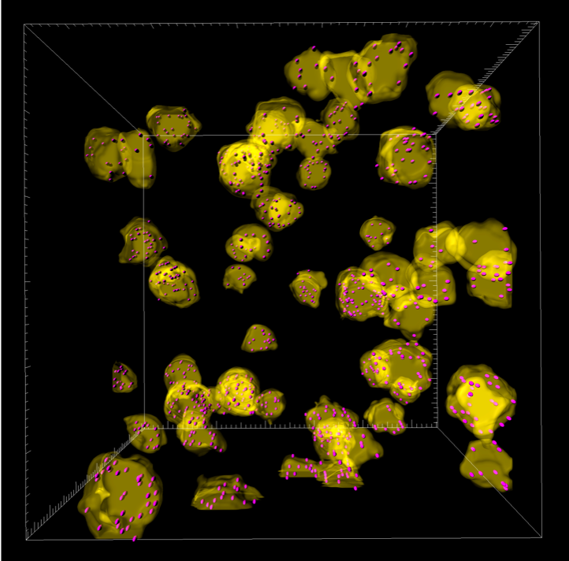
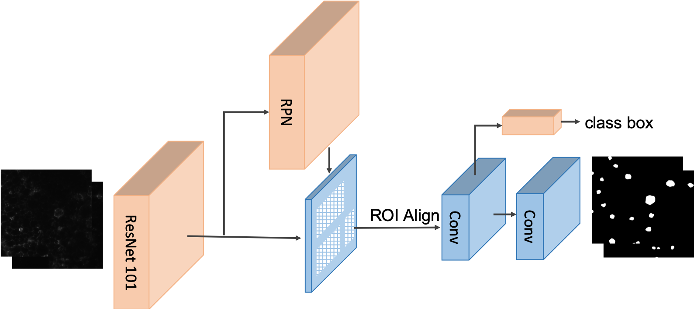
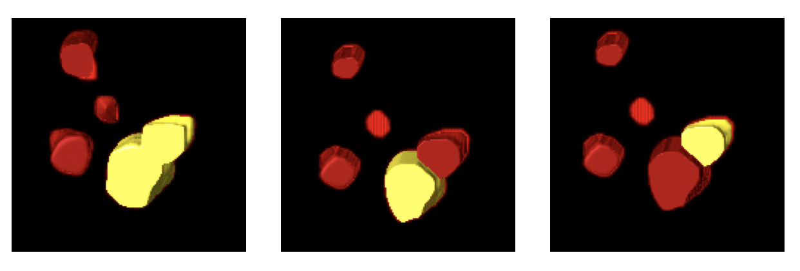

# Mask R-CNN for Crown-like Structure Detection and Segmentation in 3D Light-sheet Microscopy Imaging
This is an implementation of adapting Mask R-CNN of crown-like structure (CLS) detection and segmentation in light-sheet microscopy imaging.
<p align="center">
    
</p>
<p align="center">
    <b><em>Visualization of segemnted CLS masks overlaid on nucleus image</em></b>
</p>

The repository includes:
* Source code of adapting Mask R-CNN on CLS detection and segmentation
* Code for post-processing steps including slice compensation for maintaining 3D consistency of CLS and delineation of 3D CLS for the convenience of counting.
* Code for plotting free-response operation charactieristc (FROC) curve for performanace evaluation.
* Pre-trained model for CLS light-sheet microscopy images with ResNet-101 backbone
- Mask R-CNN architecure
<p align="center">
    
</p>

- CLS detection and segmentation pipeline visulaization 


- Post-processing results to maintain 3D CLS structure and label delineation for counting
<p align="center">
    
</p>

This code is an extension from the work of [matterport Mask R-CNN](https://github.com/matterport/Mask_RCNN). Please condider to cite both repositories (blbbex below) if you are using this in your research. You can download the pre-trained weights on [Googl Drive Pretrain Mask R-CNN CLS](https://drive.google.com/open?id=10vgXowD2M8xRrs6-A5pXCUbDlOUfan2A) and put in under this directory and change the path to load the model.

## Requirements
```
- Python 3.7.3
- Tensorflow 1.13
- Keras 2.2
- Other packages listed in the requirements.txt
```
## Implementation
## Citations
